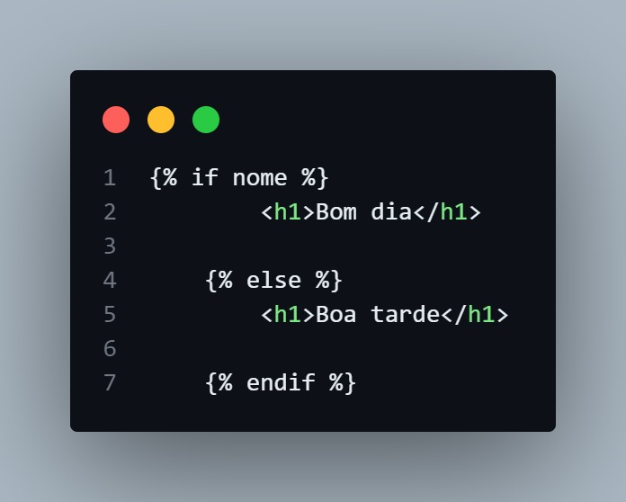

# Básico sobre path, rotas...

# Request.form
request.form["variável"] irá sempre buscar se há algum dado correspondente a variável.
Ex: Se no formulário você tem o input "nome" e nele o usuário responde Maria, ao enviar essa informação para a rota "/cadastro", ela poderá ser puxada via request.form["nome"]. Ou seja, ele vai pesquisar se existe alguma informação no formulário que foi preenchida no input do nome

# Cookies
resposta = make_response(redirect('/preferencias'))
make_response(redirect('url')) cria um objeto (chamado resposta, ou Response) que permite que você armazene cookies ou outras informações dentro dele. Ele irá guardar tudo e enviar essas informações para o url que você colocar no redirect

Basicamente:
- Cria o objeto para guardar os cookies
- Recebe todas as informações
- Redireciona o usuário para o html (com a função redirect()) via url (Seguindo o exemplo, o usuário será redirecionado para o "/preferencias")

resposta.set_cookie('nome_usuario', nome, max_age=7*3600)
resposta.set_cookie('genero', genero, max_age=7*24*3600)
resposta.set_cookie('notificacao', notificacao, max_age=7*24*3600)

Set_cookie guarda as informações que você pegou anteriormente via request.form na variável resposta (Que um objeto próprio para guardar essas informações, como foi explicado no último tópico)

nome = request.cookies.get('nome')
genero = request.cookies.get('genero')
notiticacao = request.cookies.get('notificacao')

request.cookies.get("variável") busca se há alguma informação guardada com aquele nome (Seguindo o exemplo, quer saber se há informações relacionadas ao gênero)

- Porque funciona assim?
Pois as informações são salvas como dicionários, que permitem que você acesse informações por meio do seu "rótulo".
Ex: {"nome": "Rita"}
Então sempre que você for procurar informações (Seja via request.form ou request.cookies), você deve procurar com base no "rótulo" que você deu ao input como:

request.cookies.get('nome')
request.cookies.get('genero')

# Url_for

Url_for irá sempre procurar a função Flask que você está pedindo e substituir pela rota (url path) dela:

Ex: 
@app.route('/')
def index():
    return render_template('index.html')    

o url_for teria que ser {{ url_for('index') }} e o href ficaria href="/"

# Sintaxe Jinja para o html
E as sintaxes usadas no html (Funciona igualzinho o python. Lembre-se que os nomes que você colocará são baseados nos nomes que você coloca no render template ou no set_cookies.

Ex:
render_templates('index.html', nome="Arthur")

