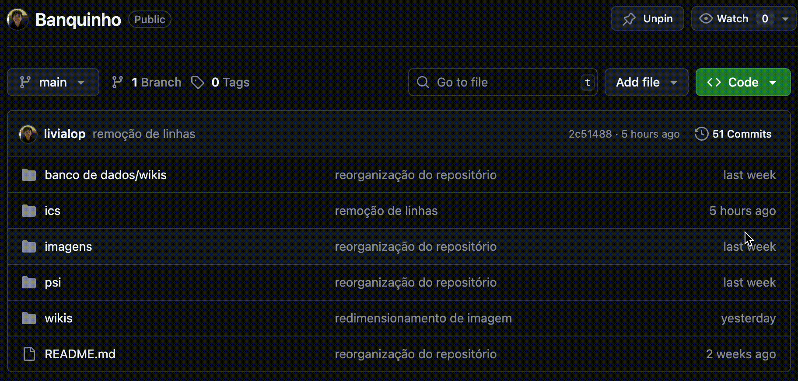

# Git
<div style='display:flex; justify-content:center; width: 30%;'>
    
</div>


## Sumário
Caso deseje, clique em qualquer um dos tópicos para ser redirecionado a ele.
* [O que é Git?](#o-que-é-git)
* [Configurando o Git](#configurando-o-git)
    * [Configuração de usuário e email](#1-configure-o-usuário-e-o-email) 
    * [Iniciando o primeiro repositório](#2-inicialize-seu-primeiro-repositório-opcional)
* [Utilizando o Git](#utilizando-o-git)
    * [Git Clone](#1-clonar-repositórios)
    * [Git Pull](#2-pull)
    * [Git Status](#2-fiz-várias-alterações-como-ver-o-que-foi-mudado)
    * [Git Commit](#3-commits)
    * [Git Push](#4-push)
    * [Conflitos e Merge](#4-conflitos-e-merge)


## O que é Git?
Git é uma ferramenta de versionamento de código/arquivos. Quando precisamos trabalhar com um grupo de pessoas para modificar um mesmo arquivo, torna-se inviável enviar o mesmo arquivo com suas modificações, pois as alterações feitas por outras pessoas podem se perder no meio do caminho, situação que piora com o aumento do número de pessoas no mesmo projeto. 

O Git surge para resolver esse problema, tornando possível que duas ou mais pessoas modifiquem um arquivo ao mesmo tempo e que essas mudanças não se percam pelo tempo. O uso dessa ferramenta torna possível também guardar *backups* dos arquivos modificados, logo, a qualquer momento você pode visualizar uma versão antiga do arquivo caso necessário.

Cada vez que uma nova versão do projeto é feita, o usuário precisa dar um ```commit``` nas alterações feitas, que nada mais é do que **postar** o arquivo com o que foi modificado. Adiante, estará disponível para leitura o passo a passo de como usar o Git sem nunca ter mexido na ferramenta e o que significa seus conceitos básicos.

> [!IMPORTANT]
> Antes de prosseguir, certifique-se de que o Git está instalado na sua máquina. Caso não tenha instalado, clique [aqui](#baixando-e-instalando-a-ferramenta-git).

> [!NOTE]
> Tem dúvidas com os conceitos que estão sendo utilizados? Você pode abrir um Issue para tirar dúvidas :D.

## Configurando o Git
Antes de começar a utilizar os comandos do git, é necessário configurar ele primeiro. Essa configuração consiste em definir o usuário, email e iniciar um repositório. 

> [!NOTE]
> Caso você já seja mais avançado/já configurou o Git, ignore esta seção.

#### 1. Configure o usuário e o email
Quando você fizer alterações em um código e registrá-los, outras pessoas precisarão identificar o responsável por aquela mudança. Por isso é importante colocar essas informações. Para isso, digite no seu terminal:
```git
git config --global user.name "Seu User"
git config --global user.email "seuemail@exemplo.com" 
```
> [!IMPORTANT]
> Isso define o seu usuário e email para toda a sua máquina. Se você, por algum motivo, não queira definir globalmente o usuário, basta não digitar a opção `--global` do comando e isso definirá seu usuário e email apenas localmente.

Se você quiser conferir ou visualizar as configurações de usuário no git, basta digitar no terminal:
```cmd
git config user.name
git config user.email
```

> [!NOTE]
> A config do user.name refere-se ao nome do usuário do Github.

#### 2. Inicialize seu primeiro repositório **(OPCIONAL)**
Esse passo não é necessário para poder utilizar o Git. Ele é apenas uma recomendação para saber como criar seu primeiro repositório com o Git. Caso você não deseje fazer essa etapa, não tem problemas e não será prejudicado por isso.

Agora, seguindo o tutorial:
1. No diretório onde você está localizado, crie uma pasta para o seu projeto.
```
mkdir MeuProjeto
cd MeuProjeto/
```
2. Agora, localizado dentro do diretório do seu projeto, para inicializar o repositório, digite no terminal:
```git
git init
```
Parabéns! Você tem o seu primeiro repositório :D.

## Utilizando o Git
Com o git já configurado, vamos entender agora como usar essa ferramenta para o versionamento de código em projetos pessoais e em equipes.

### 1. Clonar repositórios
Para copiar na sua máquina o repositório de outras pessoas, entre no repositório e copie o link HTTPS dele. 

<p style='color: green;'>> Como fazer o git clone:</p>

Após isso, acesse o diretório onde você deseja hospedar o repositório e digite no terminal:
```git
git clone https://link-do-repositorio.git
```

<div style='display:flex; justify-content: center;'>
    
</div>

### 2. Pull
Quando se está trabalhando em um projeto com várias pessoas ou utilizando duas máquinas diferentes para programar, apenas clonar o repositório não faz com que ele fique sempre atualizado. Para você não fique para trás e acabe repetindo códigos que já foram feitos, é uma boa prática fazer puxar todas as informações do repositório antes de começar a modificar ele. Para isso, basta digitar no terminal:
```cmd
git pull
```
E ele irá atualizar as informações mais recentes que estejam no Github do repositório.

> [!TIP]
> Usar `git pull` é uma boa prática para o versionamento de código. Use sempre antes de começar a modificar os arquivos, pois isso evita [conflitos](#4-conflitos-e-merge).

### 2. Fiz várias alterações, como ver o que foi mudado?
Se você criou, deletou e/ou modificou arquivos e pastas, confira o que foi alterado até o momento usando o comando `git status` no terminal. Esse comando não irá fazer nada, apenas serve para visualização do conteúdo.

<div style='display:flex; justify-content: center;'>
    
</div>

### 3. Commits
#### 3.1 O que é um commit?
Vamos entender primeiro o que é um commit e depois abordaremos os passos para realizar o seu primeiro commit. 

Fazer um commit é salvar as alterações que você fez em arquivo(s) em relação aos commits anteriores. Digamos que você está fazendo um projeto grande e a equipe não está salvando as mudanças que estão sendo feitas no código e de repente (😱!) ele para de funcionar. Ninguém teria controle e respostas para dizer o que fez o código quebrar e fazer ele retornar para um ponto onde estava funcionando corretamente.

O commit permite que você salve "versões" do seu código sempre que você altera e faz um commit, abrindo a possibilidade de sempre visualizar ou retornar a um ponto anterior.

#### 3.2 Commits
Para fazer o commit com os arquivos alterados, primeiro é necessário adicionar esses arquivos para a "lista de commit". Digite o comando no terminal do seu repositório:
```git
git add .
```
Isso fará com que tudo que foi alterado seja adicionado e pronto para dar commit. Agora o commit:

```git
git commit -m "digite aqui sua mensagem de commit"
```
A opção `-m` que vem após serve para que você possa digitar o que foi alterado para que aquele commit esteja sendo feito.

### 4. Push
Agora que você fez o commit, as alterações ainda não estão disponíveis no Github. Para fazer com que elas venham para o Github, você precisa dar um pequeno *empurrão* nela. Utilize o comando:
```git
git push 
```
Isso fará com que as mudanças subam para o seu repositório no Github.

> [!NOTE]
> De modo geral, o `git add .`, `git commit` e `git push` são utilizados seguidos um do outro.

### 4. Conflitos e merge
Como dito anteriormente, o Git é uma ferramenta para versionamento de código/arquivo. Quando duas ou mais pessoas estão alterando simultaneamente uma mesma parte de um projeto, pode acontecer conflitos no código. Mas calma! A existência de um conflito não é algo para se desesperar, pois isso acontece toda hora. 


1. Quando o Git detectar um conflito, ele irá marcar no código as diferenças:
```
<<<<<<< HEAD
seu código
=======
código de outra pessoa
>>>>>>> branch-name
```
> [!TIP]
> Clone esse repositório e visualize no VsCode como as linhas acima ficam.

2. Escolha qual versão você quer manter:
    - Mantenha o código que você quer entre os marcadores

3. Após resolver os conflitos, adicione as mudanças:
```git
git add .
git commit -m "Descrição do que foi resolvido no conflito"
git push
```

> [!TIP]
> O VSCode oferece botões "Accept Current Change", "Accept Incoming Change" ou "Accept Both Changes" para resolver conflitos mais facilmente no *Source Control*.


## Baixando e instalando a ferramenta Git
### Windows
1. Acesse a página do Git para baixar a ferramenta no Windows "https://git-scm.com/downloads/win".
2. Clique no link para fazer o download na opção mais recente, ou escolha outra desejável para você.
3. Feito o download, selecione o instalador e siga as instruções.
4. Conclua a instalação.

### Linux
1. Para o Linux, basta abrir o terminal da sua máquina e digitar o comando ```sudo apt install git```.
> [!NOTE]
> Caso esteja usando versões do Linux que não sejam compatíveis com essa sintaxe de comando, basta mudar para adaptar a sua versão.

### MacOS
1. O Git pode ser instalado a partir do XCode Command Line Tools.
2. Abra o terminal e digite `git --version`. Caso ele não estiver disponível, o próprio sistema solicitará a instalação e basta seguir as instruções.

> [!NOTE]
> Caso você possua o Homebrew já instalado no seu Mac e queira instalar o Git a partir dele, digite no terminal: `brew install git`

## Conceitos do Git
