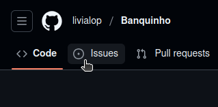
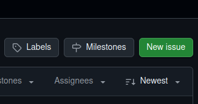

# Issues
### Para que serve um Issue?
Usuários podem (e devem!) usar issues para relatar problemas/erros em códigos, sugerir implementações e melhorias para o repositório, debater com outros usuários sobre assuntos relacionados ou corrigir qualquer outro tipo de erro. 

### Como posso abrir um?
Para abrir um issue, basta ir na aba de **Issues** no repositório e selecionar o botão **New Issue**. Após isso, basta dar um título e descrever o que você deseja.

    
    

> [!WARNING]
> Escreva coisas somente relacionadas ao repositório. Não é permitido ser desrespeitoso com outros usuários.
